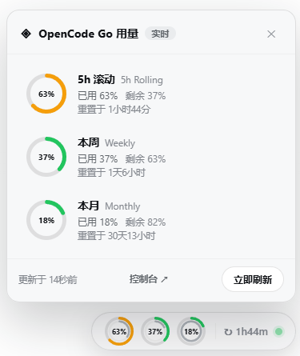

# dsh-opencode-go-usage

OpenCode Go plan usage monitor for DeepSeek Harness: a floating dock in the
web GUI showing the 5h-rolling / weekly / monthly quota windows with live
reset countdowns.

Data comes from the official quota API
(`GET https://opencode.ai/zen/go/v1/usage`, Bearer API key; no workspace id,
no cookie).

## Install

```sh
# From npm (the Web GUI runs on the `web` profile):
dsh plugin --profile web add @xueayi/dsh-opencode-go-usage
# Or from a local checkout:
dsh plugin --profile web add /path/to/dsh-opencode-go-usage
# Upgrade to the latest version:
dsh plugin --profile web update @xueayi/dsh-opencode-go-usage
```

Restart the profile afterwards (`dsh web` for the browser UI).

## Configure

**Recommended**: pick the official-channel OpenCode Go provider in
Web Settings → Models and enter the API key there; nothing else is needed.

The API key is resolved per refresh through `ctx.credentials` under the
`apiKeyEnv` reference (default `OPENCODE_GO_API_KEY`) — it can also be stored
manually in `~/.dsh/.credentials.yaml` or an environment variable:

```yaml
- insert:
    - id: opencode-go-usage
      name: '@xueayi/dsh-opencode-go-usage'
      config:
        apiKeyEnv: OPENCODE_GO_API_KEY
        refreshMs: 60000
```

| Field | Type | Default | Meaning |
| --- | --- | --- | --- |
| `apiKeyEnv` | string | `OPENCODE_GO_API_KEY` | credential reference |
| `apiKey` | string | — | direct key fallback (discouraged) |
| `endpoint` | string | `https://opencode.ai/zen/go/v1/usage` | quota endpoint |
| `refreshMs` | number | `60000` | auto-refresh interval |
| `timeoutMs` | number | `10000` | per-request timeout |

## Usage dock



A glassy floating dock at the bottom-right corner (the web shell owns no
bottom-right slot; mounted through a body portal):

- **Badge (collapsed)**: three mini double rings show all three quota
  windows at a glance — the outer ring is the used percent
  (threshold-colored: green <60% / orange ≥60% / red ≥85%), the inner ring
  is the window's remaining time until its next reset (brand blue, shrinking
  live with the window period); beside them an exact 5h-rolling countdown
  (`↻3h25m`) and a live health dot.
- **Panel (click to expand)**: one row per window (5h Rolling / Weekly /
  Monthly) with a usage ring, used/remaining percent, and a live reset
  countdown; the footer holds the update timestamp, a "Console ↗" link to
  the OpenCode Go console, and a manual refresh button.
- Unconfigured/error states render inline with configuration guidance; a
  failed fetch never blanks the dock.

## Display stability

Data and health are decoupled: when a refresh fails (timeout, API error), the
dock **keeps showing the last successful sample** — the status dot turns
yellow and a quiet "refresh failed, showing previous data" note appears in
the panel footer. The display is never blanked; error / unconfigured states
appear only before the first successful fetch.

The status dot and the manual refresh action reuse the shared
`dsh-client-ui-primitives` (`StateDot` / `Button`) so the dock's affordances
stay visually consistent with the rest of DSH. The dock also honors
`prefers-reduced-motion` (a reduced-motion environment skips the pop and ring
tweens and closes the panel without the exit animation), and the floating
badge / panel are offset by the viewport's safe-area insets so they never sit
under a notch or home indicator.

## Model Experience

### Request surface and condition

The plugin exposes no model-facing surface: the model never sees quota
values, no prompt text or tool schema is added.

#### Token effect

None — no model request, no injected tokens.

#### KV Cache effect

None — no request tokens added or replaced.

## Known Limitations and Deferred Work

- **Poll latency** — the collapsed badge polls every 60s, the open panel
  every 10s; quota changes appear within at most one poll cycle.
- **Data freshness** — after repeated failed refreshes the dock keeps showing
  the last successful sample, which grows stale until a refresh succeeds.
- **Single account** — one API key per profile; multi-account dashboards are
  out of scope.
